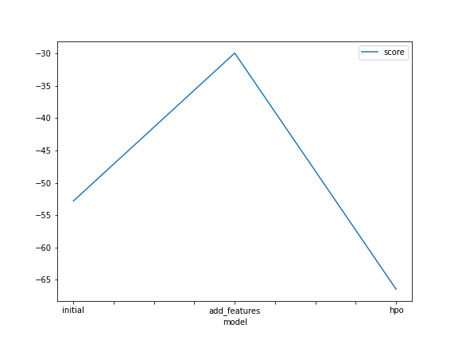
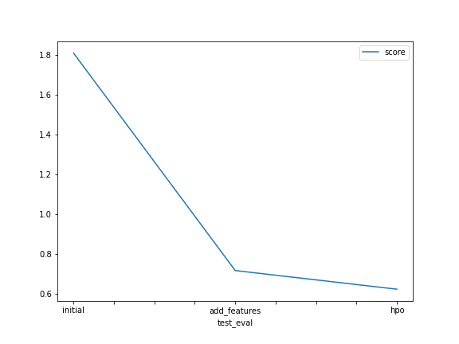

# Report: Predict Bike Sharing Demand with AutoGluon Solution
#### ANJALI SURESAN

## Initial Training
### What did you realize when you tried to submit your predictions? What changes were needed to the output of the predictor to submit your results?
Initially, I was unable to submit the predictions due to the error:'kaggle: not found'. This was solved using the '!pip install -U kaggle" command. Secondly, the negative values in the predictions had to be set to zero before the submission could be made. 

### What was the top ranked model that performed?
The top ranked model was the 'WeightedEnsemble_L3". The evaluation metric used was the root mean squared error. For this model, the validation score was 53.0822 

## Exploratory data analysis and feature creation
### What did the exploratory analysis find and how did you add additional features?
The EDA showed the distribution of the different features relative to the data using a histogram. 
I added two additional features by separating out the datetime into the hour and month features. The season and weather fetaures were also set to "category" 

### How much better did your model preform after adding additional features and why do you think that is?
After adding the two additional features and testing the models, the top ranked model (WeightedEnsemble_L3) had a validation score of 30.1709. The added features give additional insights and data for training the model, improving its effectiveness. 

## Hyper parameter tuning
### How much better did your model preform after trying different hyper parameters?
After the hyperparameter optimization, the the top ranked model (WeightedEnsemble_L3) had a validation score of 30.1296. This was not a drastic improvement. The hyperparameter changed was mainly the time_limit that was increased to further optimize the model fitting, presets was set to "optimize_for_deployment" which optimizes the model immediately for deploying by deleting the unused training artefacts. In this case, the models WeightedEnsemble_L2, RandomForestMSE_BAG_L2 and ExtraTreesMSE_BAG_L2 were deleted.  

### If you were given more time with this dataset, where do you think you would spend more time?
Hyperparameter optimization for individual models like optimizing the current 'best' model-"WeightedEnsemble_L3". I did try to optimize hyperparameter tuning for this model using hyperparameter and hyperparameter_tune_kwargs but had a persistent error that I will try to work on. 

### Create a table with the models you ran, the hyperparameters modified, and the kaggle score.
|model|time_limit|auto_stack|presets|score|
|--|--|--|--|--|
|initial|600|N/A|best_quality|1.78697|
|add_features|600|N/A|best_quality|0.68622|
|hpo|720|True|optimize_for_deployment|0.70480|

### Create a line plot showing the top model score for the three (or more) training runs during the project.

### Create a line plot showing the top kaggle score for the three (or more) prediction submissions during the project.

## Summary
The first figure shows the validation score for the top model-WeightedEnsemble_L3. It increases across the three training runs being highest for the hpo model. The second plot shows the kaggle score for the three prediction submissions.
